# Association Rule Mining for MIBI-TOF Data

This project implements a comprehensive pipeline for discovering spatial association rules between cell types in MIBI-TOF imaging data.

[](https://www.science.org/doi/full/10.1126/scitranslmed.adu6032)
[](https://data.mendeley.com/datasets/j4bscsgn6x/2)

## 1. Pipeline Workflow

The following tree illustrates the processing flow from input data to final validated rules.

<pre>
Input Data (Biopsies, FOVs, Cell Types)
  │
  ▼
Data preparation
  ├── Normelize coordinates (for microns instead of pixels)
        │
        ▼
Select Iteration Method
  ├── KNN_R
  ├── Center-Neighbour (CN)
  ├── BAGGING
  ├── GRID
  └── SLIDING WINDOW
        │
        ▼
Iterate Through FOVs (Field of Views)
  │
  ├──► [ FOV Processing Pipeline ]
  │       │
  │       ├── 1. Determine Neighborhoods (Method Dependent)
  │       ├── 2. Construct Transactions (binary presence / Gaussian-weighted float)
  │       ├── 3. Extract Rules (FP-Growth | Weighted FP-Growth)
  │       ├── 4. Filter Rules (Min Lift, Confidence, Conviction)
  │       ├── 5. Filter Rare Cell Rules (Post-Mining) <a href="#rare-cell-filter">[*]</a>
  │       ├── 6. Select Top N Rules (Ranked by Lift)
  │       ├── 7. Statistical Validation (1000 Permutations)
  │       ├── 8. FDR Correction (Benjamini-Hochberg)
  │       └── 9. Prune Redundant Rules <a href="#ref1">[1]</a>
  │               │
  │               ▼
  └──────► Output: Validated, Non-Redundant Spatial Rules
</pre>

<span id="rare-cell-filter">**[*] Post-Mining Rare Cell Filtering:**</span> After mining, rules containing cell types below an adaptive threshold (max(5 cells, 1% of FOV)) are filtered out **before validation**. This two-stage approach ensures: (1) accurate support/lift calculations during mining (preserves full spatial context), (2) computational efficiency (rare-cell rules skip expensive 1000-permutation validation), and (3) cleaner final results (no single-cell artifacts).

---

## 1b. Algorithm Comparison: FP-Growth vs Weighted FP-Growth

| Metric | FP-Growth formula | FP-Growth meaning | Weighted FP-Growth formula | Weighted FP-Growth meaning |
| :--- | :--- | :--- | :--- | :--- |
| **Transaction** | `{T_cell, B_cell, ...}` | Cell type is present (1) or absent (0) | `{T_cell: 0.6, B_cell: 0.2, ...}` | Gaussian diffusion weight — closer cells score higher |
| **Support** | `count(A∪B) / N` | Fraction of neighborhoods containing all items | `Σ min(wᵢ for i∈A∪B) / N` | Avg intensity of weakest co-diffusing item across neighborhoods |
| **Confidence** | `support(A∪B) / support(A)` | How often B is present when A is present | `support(A∪B) / support(A)` | How strongly B co-diffuses relative to A's intensity |
| **Lift** | `confidence / support(B)` | Co-occurrence above random chance | `confidence / support(B)` | Same — but chance baseline uses diffusion weights |
| **Leverage** | `support(A∪B) − support(A)·support(B)` | Excess co-occurrence beyond independence | `support(A∪B) − support(A)·support(B)` | Same — negative means diffusion signals repel |
| **Conviction** | `(1 − support(B)) / (1 − confidence)` | How often A occurs without B (∞ = always together) | `(1 − support(B)) / (1 − confidence)` | Same interpretation, operating on diffusion-weighted supports |

*Supported spatial methods — FP-Growth: BAG, CN, KNN_R, GRID, WINDOW. Weighted FP-Growth: CN, KNN_R (requires a defined center cell).*

---

## 2. Data Exploration & Pipeline Efficiency

The following tables demonstrate the efficiency of different neighborhood definition methods in retaining significant rules after rigorous statistical validation.

### High Threshold Configuration (Default)
*Note the high retention rate and significance for KNN_R and CN methods compared to sliding window approaches.*

> | METHOD | RAW Count | FINAL Count | RETENTION % | RAW/FOV | FINAL/FOV | AVG LIFT (Raw->Final) | SIG (FDR<0.01) | SIG (P<0.01) |
> | :--- | :--- | :--- | :--- | :--- | :--- | :--- | :--- | :--- |
> | **BAG** | 6778 | 3568 | 52.64% | 32.4 | 17.1 | 1.93 -> 2.01 | 71.2% -> 68.9% | 78.0% -> 75.6% |
> | **CN** | 11806 | 2878 | 24.38% | 56.0 | 13.6 | 2.58 -> 3.03 | 96.5% -> 98.4% | 97.2% -> 98.9% |
> | **KNN_R** | 11806 | 2878 | 24.38% | 56.0 | 13.6 | 2.58 -> 3.03 | 96.6% -> 98.5% | 97.1% -> 98.8% |
> | **WINDOW** | 1,048,959 | 257,427 | 24.54% | 4971.4 | 1220.0 | 22.13 -> 3.84 | 74.0% -> 13.3% | 78.5% -> 29.7% |
> | **GRID** | 420 | 414 | 98.57% | 2.3 | 2.3 | 2.56 -> 2.57 | 96.2% -> 95.9% | 97.1% -> 97.3% |

### Low Threshold Configuration
*Relaxed constraints lead to higher rule counts but potentially lower precision.*

> | METHOD | RAW Count | FINAL Count | RETENTION % | RAW/FOV | FINAL/FOV | AVG LIFT (Raw->Final) | SIG (FDR<0.01) | SIG (P<0.01) |
> | :--- | :--- | :--- | :--- | :--- | :--- | :--- | :--- | :--- |
> | **BAG** | 29267 | 14609 | 49.92% | 138.7 | 69.2 | 1.68 -> 1.84 | 11.2% -> 11.4% | 27.0% -> 28.5% |
> | **CN** | 25816 | 9124 | 35.34% | 122.4 | 43.2 | 2.31 -> 2.60 | 48.0% -> 51.5% | 56.6% -> 58.9% |
> | **KNN_R** | 25816 | 9124 | 35.34% | 122.4 | 43.2 | 2.31 -> 2.60 | 48.0% -> 51.5% | 56.8% -> 58.8% |

---

## 3. Top Ranked Rules by Method
*A sample of the highest lift rules discovered by each method, showing rule strength (Lift), certainty (Confidence), and statistical significance (FDR).*

> | METHOD | RULE | LIFT | CONF | CONV | SUP | FDR |
> | :--- | :--- | :--- | :--- | :--- | :--- | :--- |
> | **BAG** | Endothelial, Muscle -> BrunnerGland, CD4T | 18.98 | 0.95 | 19.95 | 0.011 | 0.2709 |
> | **BAG** | Muscle, SMV -> BrunnerGland, CD4T | 15.95 | 0.80 | 4.75 | 0.011 | 0.1620 |
> | **BAG** | Muscle -> Epithelial, Goblet | 0.07 | 0.03 | 0.58 | 0.013 | 0.0022 |
> | **BAG** | Muscle -> Epithelial | 0.07 | 0.03 | 0.52 | 0.011 | 0.0033 |
> | --- | --- | --- | --- | --- | --- | --- |
> | **CN** | Endothelial_NEIGHBOR, Muscle_CENTER -> Epithelial_NEIGHBOR, Muscle_NEIGHBOR | 44.29 | 0.73 | 3.69 | 0.010 | 0.0013 |
> | **CN** | Muscle_CENTER -> Muscle_NEIGHBOR, Paneth_NEIGHBOR | 34.46 | 0.89 | 8.96 | 0.019 | 0.0020 |
> | **CN** | Muscle_CENTER -> Epithelial_NEIGHBOR | 0.07 | 0.04 | 0.48 | 0.011 | 0.0014 |
> | **CN** | Fibroblast_NEIGHBOR, Muscle_CENTER -> Epithelial_NEIGHBOR | 0.08 | 0.04 | 0.48 | 0.011 | 0.0014 |
> | --- | --- | --- | --- | --- | --- | --- |
> | **KNN_R** | Endothelial_NEIGHBOR, Muscle_CENTER -> Epithelial_NEIGHBOR, Muscle_NEIGHBOR | 46.98 | 0.73 | 3.69 | 0.010 | 0.0012 |
> | **KNN_R** | Muscle_CENTER, Plasma_NEIGHBOR -> Muscle_NEIGHBOR, Neuron_NEIGHBOR | 35.02 | 0.95 | 20.43 | 0.010 | 0.0017 |
> | **KNN_R** | Muscle_CENTER -> Macrophage_NEIGHBOR, Neutrophil_NEIGHBOR | 0.11 | 0.08 | 0.33 | 0.011 | 0.0013 |
> | **KNN_R** | Epithelial_CENTER -> CD4T_NEIGHBOR, Mesenchymal_VIM_NEIGHBOR, SMV_NEIGHBOR | 0.12 | 0.05 | 0.65 | 0.012 | 0.0014 |
> | --- | --- | --- | --- | --- | --- | --- |


---

## 4. Results Analysis

This section highlights key performance metrics, with a focus on the **K-Nearest Neighbors (Radius)** method, which showed a strong balance between rule discovery and statistical significance.

### Overview of Rules Found
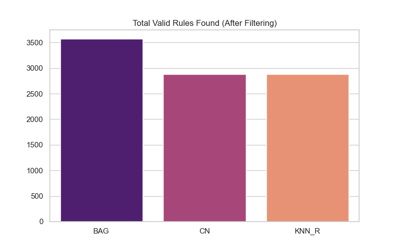

### Rule Significance Comparison (Volcano Plots)
The primary volcano plots below illustrate the relationship between Rule Lift (strength) and FDR Significance for the **final, validated rules**. KNN_R and CN consistently produce high-lift, highly significant rules (top right quadrant).

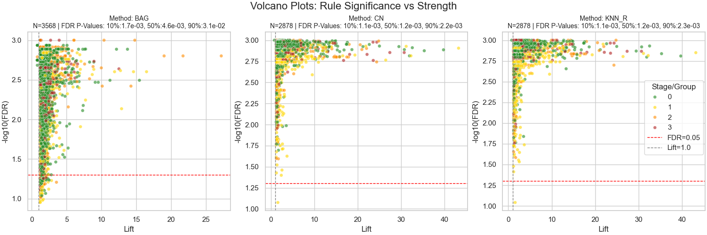

#### Comparative Analysis: Raw Rules & Low Thresholds
*Below, we compare the final results against the raw (unfiltered) rules and a separate experimental run with relaxed thresholds.*

**1. Raw Rules (Before Filtering)**
> 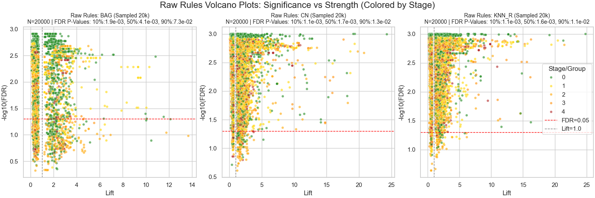

### Rules per FOV (KNN_R)
Distribution of the number of validated rules found in each Field of View (FOV) using the KNN_R method.
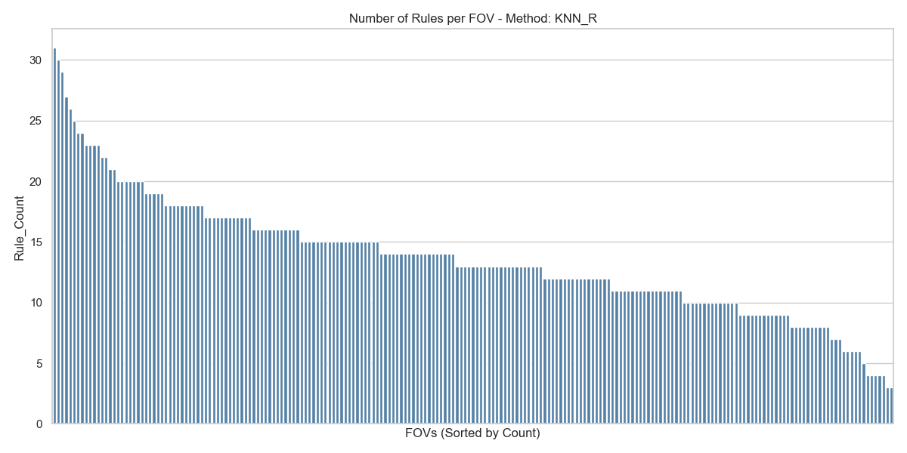

---

## 5. Consensus & Stability Analysis

[📂 View Full Consensus Plots Directory](results/full_run/plots/consensus_report)

This section analyzes the stability of rules across different biological scales: Global (Dataset), Stage (Disease Group), and Biopsy (Patient).

### Global Consensus (Universal Rules)
*The rules appearing most frequently across the entire dataset, representing fundamental tissue structure.*

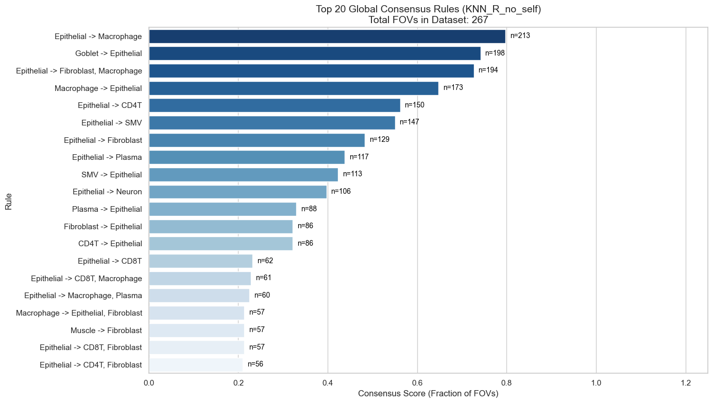

### Patient Similarity (Biopsy Clustering - CN)
*Clustering patients based on the similarity of their rule sets (Jaccard Index). Groupings here indicate shared tissue microenvironments.*

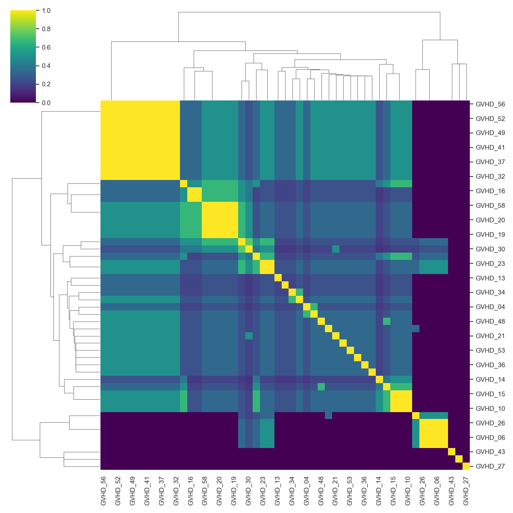

### Stage Specificity (Disease Signatures)
*Comparing rule prevalence across Pathological Stages. The heatmap highlights rules that are specific to certain stages versus those that are stable throughout.*

| **Stage Consensus (with Self-Rules)** | **Stage Consensus (No Self-Rules)** |
| :---: | :---: |
| 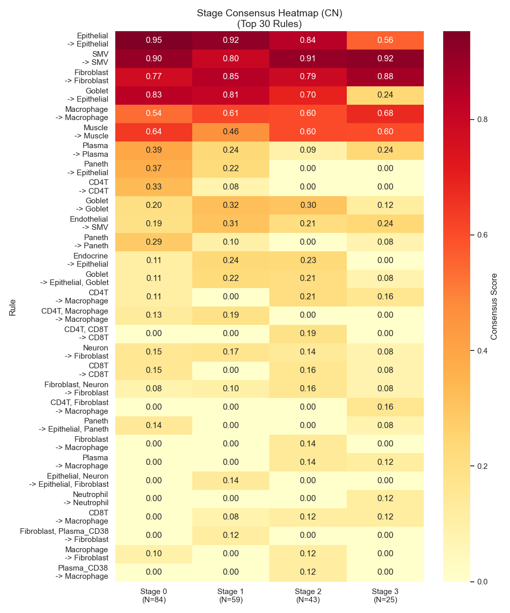 | 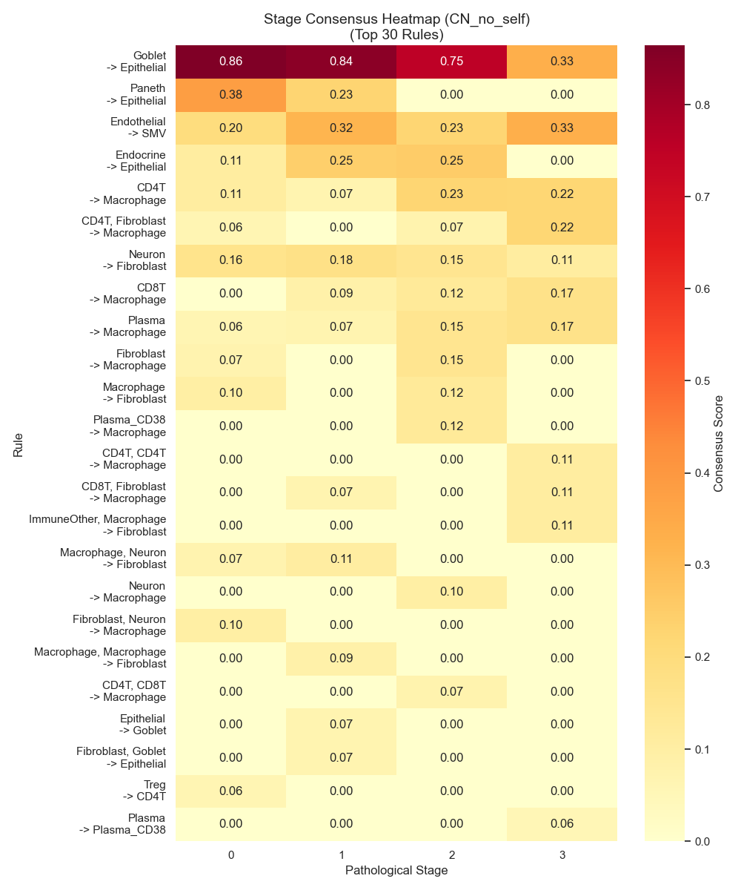 |

---

## 6. Top Spatial Rules Visualization

[📂 View Full Collection of Spatial Plots](results/full_run/plots/top_rules_spatial)

Visualizing the top 3 ranked unique spatial rules (excluding self-referential rules) for KNN_R and BAG.

### Method: KNN_R (K-Nearest Neighbors Radius)
| Rank 1 | Rank 2 | Rank 3 |
| :---: | :---: | :---: |
| 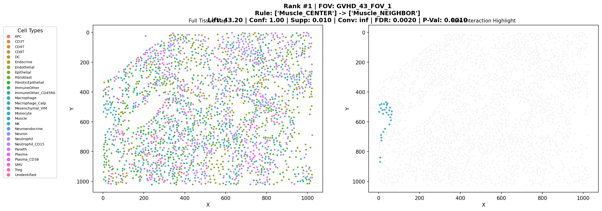 | 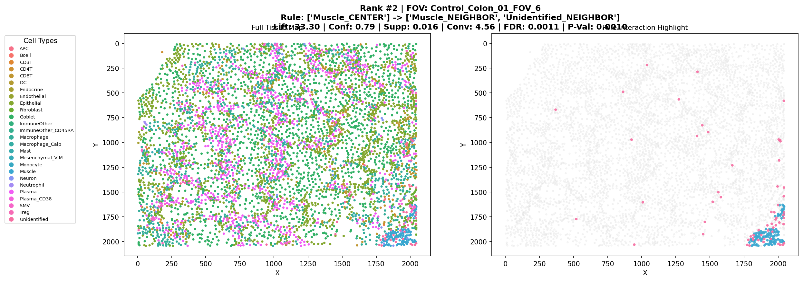 | 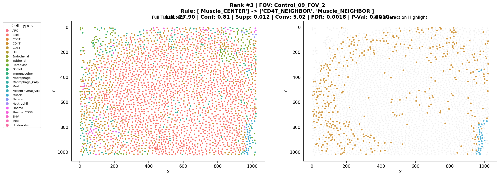 |

### Method: BAG (Bagging)
| Rank 1 | Rank 2 | Rank 3 |
| :---: | :---: | :---: |
| 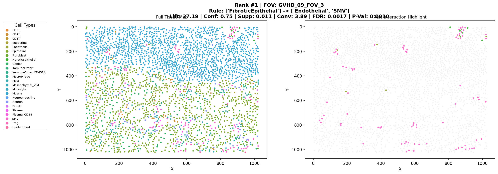 |  | 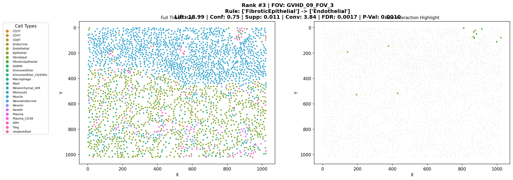 |

---

## 7. References

<span id="ref1">1.</span> <span style="color: #808080; font-style: italic;">Bayardo Jr, R. J., Agrawal, R., & Gunopulos, D. (2000). Constraint-based rule mining in large, dense databases. Data mining and knowledge discovery, 4(2), 217-240. <a href="https://www.bayardo.org/ps/icde99.pdf">[PDF]</a></span>

---

## 8. Environment Setup

This project uses `pyproject.toml` for dependency management. 

Once you have created and activated your Python environment (either via Conda or `venv`), install the project and its dependencies by running:

```bash
pip install -e .
```