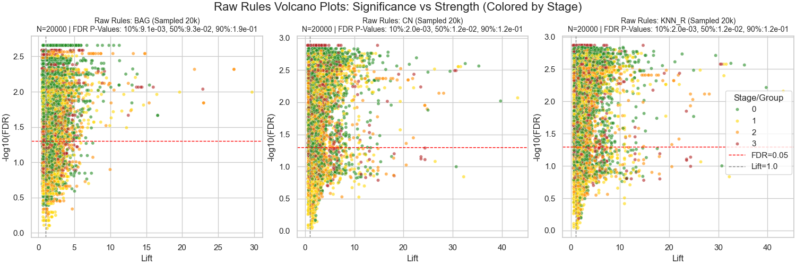
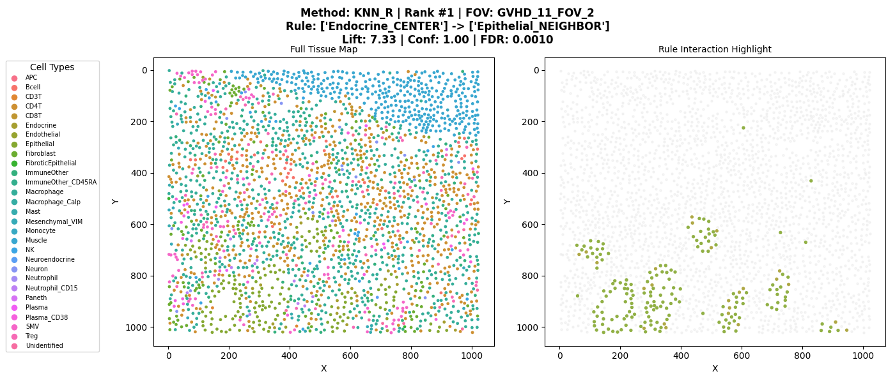
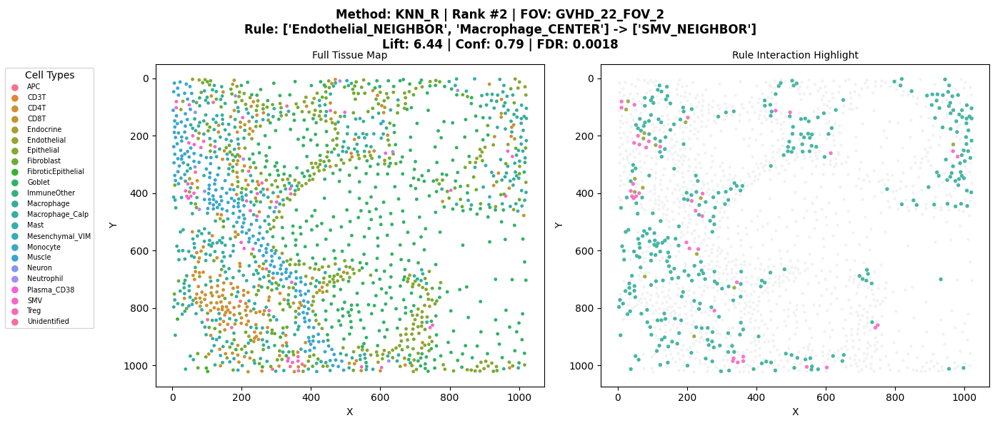
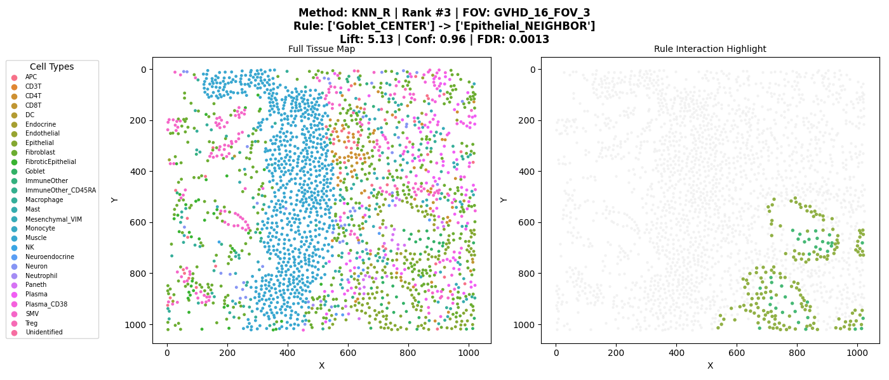
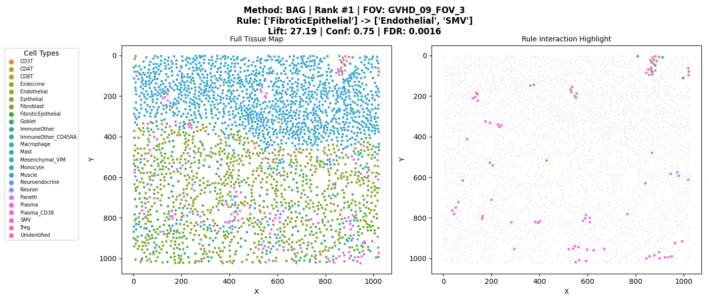
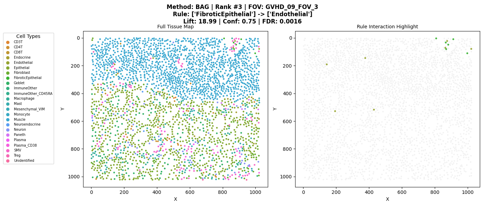

# Association Rule Mining for MIBI-TOF Data

This project implements a comprehensive pipeline for discovering spatial association rules between cell types in MIBI-TOF imaging data.

## 1. Pipeline Workflow

The following tree illustrates the processing flow from input data to final validated rules.

<pre>
Input Data (Biopsies, FOVs, Cell Types)
  │
  ▼
Select Iteration Method
  ├── KNN_R
  ├── Center-Neighbour (CN)
  ├── BAGGING
  ├── GRID
  └── SLIDING WINDOW
        │
        ▼
Iterate Through FOVs (Field of Views)
  │
  ├──► [ FOV Processing Pipeline ]
  │       │
  │       ├── 1. Determine Neighborhoods (Method Dependent)
  │       ├── 2. Construct Transaction Sets
  │       ├── 3. Extract Rules (FP-Growth Algorithm)
  │       ├── 4. Filter Rules (Min Lift, Confidence, Conviction)
  │       ├── 5. Select Top N Rules (Ranked by Lift)
  │       ├── 6. Statistical Validation (1000 Permutations)
  │       ├── 7. FDR Correction (Benjamini-Hochberg)
  │       └── 8. Prune Redundant Rules <a href="#ref1">[1]</a>
  │               │
  │               ▼
  └──────► Output: Validated, Non-Redundant Spatial Rules
</pre>

---

## 2. Data Exploration & Pipeline Efficiency

The following tables demonstrate the efficiency of different neighborhood definition methods in retaining significant rules after rigorous statistical validation.

### High Threshold Configuration (Default)
*Note the high retention rate and significance for KNN_R and CN methods compared to sliding window approaches.*

> | METHOD | RAW Count | FINAL Count | RETENTION % | RAW/FOV | FINAL/FOV | AVG LIFT (Raw->Final) | SIG (FDR<0.01) | SIG (P<0.01) |
> | :--- | :--- | :--- | :--- | :--- | :--- | :--- | :--- | :--- |
> | **BAG** | 6778 | 3568 | 52.64% | 32.4 | 17.1 | 1.93 -> 2.01 | 71.2% -> 68.9% | 78.0% -> 75.6% |
> | **CN** | 11806 | 2878 | 24.38% | 56.0 | 13.6 | 2.58 -> 3.03 | 96.5% -> 98.4% | 97.2% -> 98.9% |
> | **KNN_R** | 11806 | 2878 | 24.38% | 56.0 | 13.6 | 2.58 -> 3.03 | 96.6% -> 98.5% | 97.1% -> 98.8% |
> | **WINDOW** | 1,048,959 | 257,427 | 24.54% | 4971.4 | 1220.0 | 22.13 -> 3.84 | 74.0% -> 13.3% | 78.5% -> 29.7% |
> | **GRID** | 420 | 414 | 98.57% | 2.3 | 2.3 | 2.56 -> 2.57 | 96.2% -> 95.9% | 97.1% -> 97.3% |

### Low Threshold Configuration
*Relaxed constraints lead to higher rule counts but potentially lower precision.*

> | METHOD | RAW Count | FINAL Count | RETENTION % | RAW/FOV | FINAL/FOV | AVG LIFT (Raw->Final) | SIG (FDR<0.01) | SIG (P<0.01) |
> | :--- | :--- | :--- | :--- | :--- | :--- | :--- | :--- | :--- |
> | **BAG** | 29267 | 14609 | 49.92% | 138.7 | 69.2 | 1.68 -> 1.84 | 11.2% -> 11.4% | 27.0% -> 28.5% |
> | **CN** | 25816 | 9124 | 35.34% | 122.4 | 43.2 | 2.31 -> 2.60 | 48.0% -> 51.5% | 56.6% -> 58.9% |
> | **KNN_R** | 25816 | 9124 | 35.34% | 122.4 | 43.2 | 2.31 -> 2.60 | 48.0% -> 51.5% | 56.8% -> 58.8% |

---

## 3. Top Ranked Rules by Method
*A sample of the highest lift rules discovered by each method, showing rule strength (Lift), certainty (Confidence), and statistical significance (FDR).*

> | METHOD | RULE | LIFT | CONF | CONV | SUP | FDR |
> | :--- | :--- | :--- | :--- | :--- | :--- | :--- |
> | **BAG** | FibroticEpithelial -> Endothelial, SMV | 27.19 | 0.75 | 3.89 | 0.011 | 0.0016 |
> | **BAG** | FibroticEpithelial, SMV -> Endothelial | 21.70 | 0.86 | 6.72 | 0.011 | 0.0016 |
> | --- | --- | --- | --- | --- | --- | --- |
> | **CN** | Muscle_CENTER -> Muscle_NEIGHBOR | 43.20 | 1.00 | inf | 0.010 | 0.0012 |
> | **CN** | Muscle_CENTER -> Fibroblast_NEIGHBOR, Muscle_NEIGHBOR | 27.37 | 0.77 | 4.17 | 0.010 | 0.0014 |
> | --- | --- | --- | --- | --- | --- | --- |
> | **KNN_R** | Muscle_CENTER -> Muscle_NEIGHBOR | 43.20 | 1.00 | inf | 0.010 | 0.0014 |
> | **KNN_R** | Muscle_CENTER -> Fibroblast_NEIGHBOR, Muscle_NEIGHBOR | 27.37 | 0.77 | 4.17 | 0.010 | 0.0014 |
> | --- | --- | --- | --- | --- | --- | --- |
> | **WINDOW** | Endocrine, Unidentified -> Epithelial, Monocyte | 100.00 | 1.00 | inf | 0.010 | 0.0147 |
> | **WINDOW** | Endocrine, Endothelial -> CD8T, Epithelial | 100.00 | 1.00 | inf | 0.010 | 0.0147 |
> | --- | --- | --- | --- | --- | --- | --- |
> | **GRID** | Paneth -> Epithelial | 12.67 | 1.00 | inf | 0.011 | 0.0010 |
> | **GRID** | Endocrine -> Epithelial | 9.43 | 0.79 | 4.28 | 0.018 | 0.0010 |

---

## 4. Results Analysis

This section highlights key performance metrics, with a focus on the **K-Nearest Neighbors (Radius)** method, which showed a strong balance between rule discovery and statistical significance.

### Overview of Rules Found

### Rule Significance Comparison (Volcano Plots)
The primary volcano plots below illustrate the relationship between Rule Lift (strength) and FDR Significance for the **final, validated rules**. KNN_R and CN consistently produce high-lift, highly significant rules (top right quadrant).

#### Comparative Analysis: Raw Rules & Low Thresholds
*Below, we compare the final results against the raw (unfiltered) rules and a separate experimental run with relaxed thresholds.*

**1. Raw Rules (Before Filtering)**
> 

**2. Low Threshold Run (Relaxed Constraints)**
*Note the denser cloud of lower-lift rules in this experimental configuration.*
> 

### Rules per FOV (KNN_R)
Distribution of the number of validated rules found in each Field of View (FOV) using the KNN_R method.

---

## 5. Top Spatial Rules Visualization

[📂 View Full Collection of Spatial Plots](results/full_run/plots/top_rules_spatial)

Visualizing the top 3 ranked unique spatial rules (excluding self-referential rules) for KNN_R and BAG.

### Method: KNN_R (K-Nearest Neighbors Radius)
| Rank 1 | Rank 2 | Rank 3 |
| :---: | :---: | :---: |
|  |  |  |

### Method: BAG (Bagging)
| Rank 1 | Rank 2 | Rank 3 |
| :---: | :---: | :---: |
|  |  |  |

---

## 6. References

1. Bayardo Jr, R. J., Agrawal, R., & Gunopulos, D. (2000). Constraint-based rule mining in large, dense databases. Data mining and knowledge discovery, 4(2), 217-240. <a href="https://www.bayardo.org/ps/icde99.pdf">[PDF]</a>

